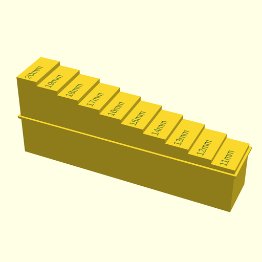

# luizribeiro/3d-models

[](https://travis-ci.com/luizribeiro/3d-models)

This is a collection of 3D models designed by myself on
[OpenSCAD](https://www.openscad.org/).

## stairs.scad

This generates staircases which can be helpful for calibration of 3D
printers. For example, if you want to generate a model for stairs where
each step has 0.5mm of height, you should run the following command:

```
openscad -o stairs-0d5mm.stl -D "step_height=0.50" stairs.scad
```

There are a bunch of parameters on the module itself you can play with.

### Example Render


